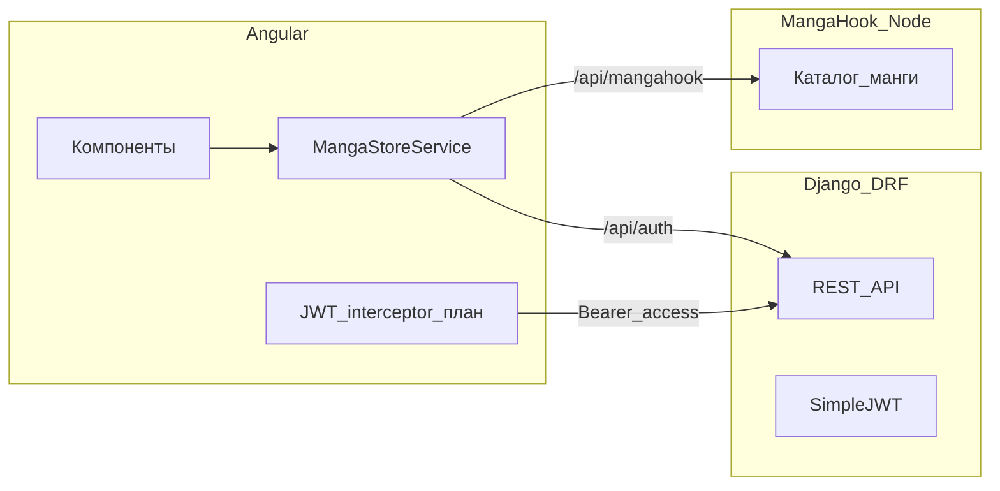

# План: полное соответствие требованиям Web Development (Angular + Django)

## Что уже закрывает требования (кратко)

- **Django + DRF:** модели, `ForeignKey`, кастомный `MangaManager`, смесь `Serializer` / `ModelSerializer`, FBV + CBV, JWT (Simple JWT + blacklist), CRUD для `Manga`, привязка `created_by` / `user` при создании, CORS — см. [`backend/catalog/`](backend/catalog/), [`backend/mangabackend/settings.py`](backend/mangabackend/settings.py).
- **Angular:** маршруты (≥3), `@for` / `@if`, `[(ngModel)]` (≥4 на [`manga-catalogue/src/app/features/auth/login-page.component.ts`](manga-catalogue/src/app/features/auth/login-page.component.ts)), стили, один сервис с `HttpClient` — [`manga-catalogue/src/app/core/manga-store.service.ts`](manga-catalogue/src/app/core/manga-store.service.ts), интерфейсы — [`manga-catalogue/src/app/core/manga-data.ts`](manga-catalogue/src/app/core/manga-data.ts).
- **Интеграция dev:** прокси — [`manga-catalogue/proxy.conf.json`](manga-catalogue/proxy.conf.json) (Django `:8000`, MangaHook `:3000`).

---

## Критичные пробелы относительно PDF

### 1. JWT на фронтенде (требование явное)

Сейчас: регистрация бьёт в Django; **вход** в [`MangaStoreService.login()`](manga-catalogue/src/app/core/manga-store.service.ts) только выставляет сигналы, **без** `POST /api/auth/login/`; **interceptor отсутствует**; **выход** не вызывает [`LogoutView`](backend/catalog/views.py) и не инвалидирует refresh.

**Нужно сделать:**

- Хранилище токенов (например `localStorage` или `sessionStorage`): `access`, `refresh`.
- После успешного **логина** — `POST` на `http://localhost:8000/api/auth/login/` (через прокси `/api/auth/login/`) с `username`/`password`, сохранить пару токенов.
- **HTTP interceptor** (functional `HttpInterceptorFn`): для запросов к Django (например пути `/api/auth/` кроме login/register/refresh, `/api/manga/`, `/api/reading-list/` и т.д.) добавлять заголовок `Authorization: Bearer <access>`; при `401` — попытка refresh через `/api/auth/refresh/`, повтор запроса, иначе очистка и редирект на `/login`.
- **Logout:** `POST /api/auth/logout/` с телом `{ "refresh": "<refresh>" }` (как ожидает [`LogoutView`](backend/catalog/views.py)), затем очистка хранилища и сигналов.
- Подключить interceptor в [`manga-catalogue/src/app/app.config.ts`](manga-catalogue/src/app/app.config.ts) через `provideHttpClient(withInterceptors([...]))`.
- Обновить [`login-page.component.ts`](manga-catalogue/src/app/features/auth/login-page.component.ts): режим «Вход» должен вызывать реальный login API, а не только `store.login()` без сети.
- Обновить [`shell.component.ts`](manga-catalogue/src/app/features/shell/shell.component.ts) (и при необходимости guard): при старте приложения, если есть валидный `access` (или успешный refresh), считать пользователя авторизованным.

Итог: на защите можно честно сказать: «JWT выдаёт Django, фронт подставляет access в каждый защищённый запрос через interceptor, выход блэклистит refresh».

### 2. Postman: «все запросы» и «example responses»

Файл [`backend/MangaCatalogue-Postman-Collection.json`](backend/MangaCatalogue-Postman-Collection.json) сейчас **неполный** (нет register, refresh, logout, search, деталь манги PUT/DELETE, полный reading-list и т.д.) и везде `"response": []` — **примеры ответов не сохранены**, хотя в требованиях указано explicitly.

**Нужно:** расширить коллекцию всеми эндпоинтами из [`backend/catalog/urls.py`](backend/catalog/urls.py) и для ключевых запросов добавить сохранённые примеры ответов (успех и при желании 400/401). В Postman это делается через Save Response → затем экспорт коллекции; либо вручную заполнить массив `response` в JSON.

### 3. README и демо (организационные требования)

- В [`README.md`](README.md) стоит добавить: состав группы (уже есть), **как запустить** (порядок: Django, MangaHook, `ng serve` с `--proxy-config`), переменные при необходимости, ссылку на Postman.
- Исправить разметку (лишний `</a>` без открывающего тега) — мелочь, но аккуратнее для проверяющего.
- **Презентация PDF до 4 страниц** и **живая демо** — не код, но в чеклисте защиты.

---

## Желательно (сильнее демо и соответствие описанию в README)

README обещает «ratings, comments, reading lists» — на бэкенде это есть (`Review`, `ReadingList`), но **UI сейчас держит избранное и рейтинг только в памяти** ([`manga-detail-page.component.ts`](manga-catalogue/src/app/features/manga-detail/manga-detail-page.component.ts)).

Опционально (если хватит времени):

- На странице тайтла: отправка **отзыва** на `POST /api/manga/:id/reviews/` и отображение списка с `GET`.
- Профиль: **reading list** через `GET/POST/DELETE /api/reading-list/` с маппингом ID: внешние ID MangaHook vs PK в Django — потребуется явная договорённость (отдельное поле, или только «своя» манга из Django). Это архитектурное решение; если не трогать — на вопрос отвечать: «каталог внешний, пользовательские сущности в Django готовы к расширению».

---

## Мини-чеклист перед защитой

| Требование PDF | Статус |
|----------------|--------|
| Interceptor + login + logout (JWT) | Сделать |
| Postman: все запросы + примеры ответов | Доработать |
| 4+ клика → API | Уже есть (каталог/регистрация); после JWT — login/logout тоже |
| Остальное по Angular/Django | В основном есть |

---

## Рекомендуемый порядок работ

1. Реализовать хранение токенов + login/logout + interceptor (максимальный приоритет).
2. Обновить Postman и закоммитить.
3. README с инструкцией запуска и ссылкой на коллекцию.
4. По силам — связать деталь/профиль с Review/ReadingList API.
